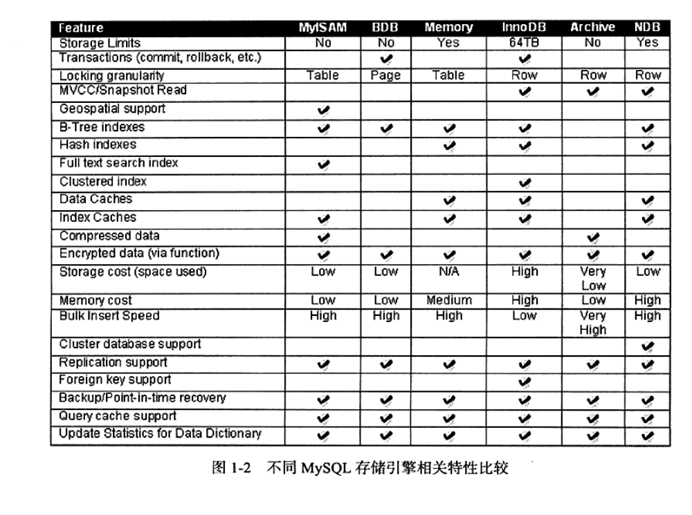

# 第1章MySQL体系结构和存储引擎

## 1.1 数据库和实例的定义
- 数据库：物理操作系统文件和其它形式文件类型的集合。（MySQL主要是frm、MYD，MYI、ibd结尾文件，NDB引擎是放在内存中）
- 实例：MySQL数据库由后台线程和一个共享内存区构成。负责操作数据库文件。（在单一的是一个实例对应一个数据库，在集群中有可能多个实例对应一个数据库）
> 在系统中实例就是相当于线程

## 1.2 MySQL体系结构

### 组成部分
- 连接池组件
- 管理服务和工具组件
- SQL接口组件
- 查询分析器组件
- 优化器组件
- 缓冲组件
- 插件式存储引擎
- 物理文件

> 需要注意的是，存储引擎是基于表，而不是数据库

## 1.3 MySQL存储引擎
> 存储引擎的优点：每个存储引擎有自己的特点，我们可以需要根据不同的应用场景使用不同

### 1.3.1 InnoDB存储引擎

InnoDB存储引擎支持事务，目标设计适用于联机交易（OLTP）场景，其中的特点：
- 行锁设计
- 外键（一般不用）
- 默认读取操作不会产生锁（类似于Oracle的非锁定读）

InnoDB通过使用多版本并发控制（MVCC）来获得高并发性，且实现SQL标准的**4种隔离级别**
> 为了避免幻读，使用了next-key locking的策略来避免幻读（phantom）现象的产生
- 读未提交（read-uncommitted）
- 不可重复读（read-committed）
- 可重复读（repeatable-read）**MySQL默认的事务格林**
- 串行化（serializable）

InnoDB以下高性能和高可用的功能：
- 插入缓冲（insert buffer）
- 二次写（double write）
- 自适应哈希索引（adaptive hash index）
- 预读（read ahead）

> 对于每张表数据的存储来说，InnoDB会根据聚集（clustered）索引，按照这个索引的顺序存放。
> （没有指定聚集主键，就默认一个6字节RowId）

### 1.3.2 MyISAM存储引擎
MyISAM存储引擎不支持事务、表锁设计，支持全文索引，主要面对联机分析（OLAP）场景
> MyISAM存储引擎表由MD和MYI组成，MYD存放数据文件，MYI存放索引文件。
> 并且可以通过myisampack工具压缩成制度文件

### 1.3.3 NDB存储引擎
NDB引擎和Oracle的RAC集群
> Oracle的RAC集群share everything，NDB存储引擎是share nothing集群架构，NDB的特点是数据全部放在内存（从MySQL5.1版本，可以将非索引放在磁盘），
> 因为放在内存的原因，省略了磁盘读写的速度缺失，所以是个高可用、高性能的集群系统。
> 又因为NDB存储引擎，有一个问题就是NDB存储引起的连接（join）操作是在MySQL数据层完成，不是在存储引擎层完成，需要庞大的**网络开销**

### 1.3.4 Memory引擎
> Memory存储引起是把表的数据放入内存，所以适合存储数据的临时表（因为数据库重启崩溃就没了）
> 优点：速度快，缺点：只支持表锁（于是并发性差）

### 1.3.5 Archive存储引擎
> 只支持INSERT和SELECT操作，适合用在归档数据（比如：日志存储），专门提供高速插入和压缩功能。

### 1.3.6 Federated存储引擎
> Federated存储引擎（只支持MySQL数据库表）不存储数据，只想远程MySQL数据库服务器上的表。类似于SQL Server的链接服务器和Oracle的透明网关

### 1.3.7 Maria存储引擎
> Maria引擎（MySQL的默认存储引擎），特点：支持缓存数据和索引文件，应用了行锁设计，提供了MVCC功能，支持事务和非事务安全的选项，和更好的BLOB字符类型处理。

## 1.4 各存储引擎之间的比较

